### chrome浏览器的开发者工具用法
1.如果是样式问题 ,使用elment按钮，修改右边的代码，即可查看修改完之后的效果 
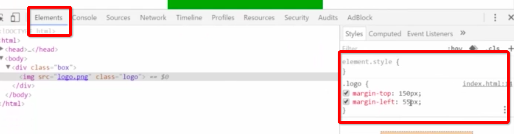
2.图片加载不出来，查看network和右上角的小红叉，查看错误信息 
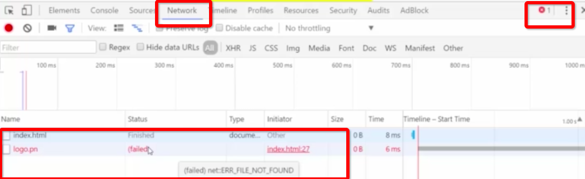
3.如何增加一个样式，点击右边的➕就可以增加一个样式，然后再修改html代码，就可以看见效果 
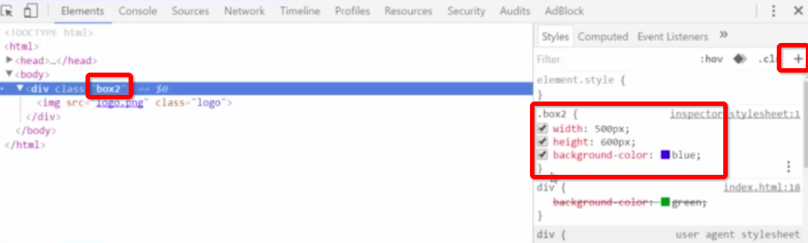

4.不知道怎么调整颜色，点击小色块会出现调整器： 
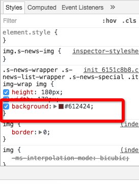

5.如何保存网页上的图片：点击如下所示，然后会重新打开一个链接，然后就可以点击另存为 
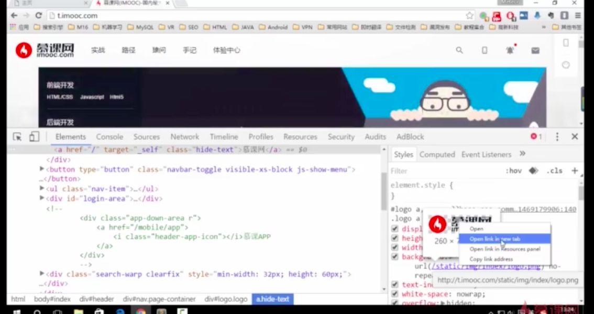

6.调试js程序 
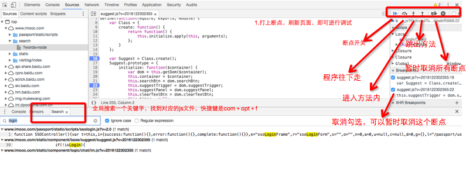
7.调试压缩过的代码：点击下面的｛｝ 
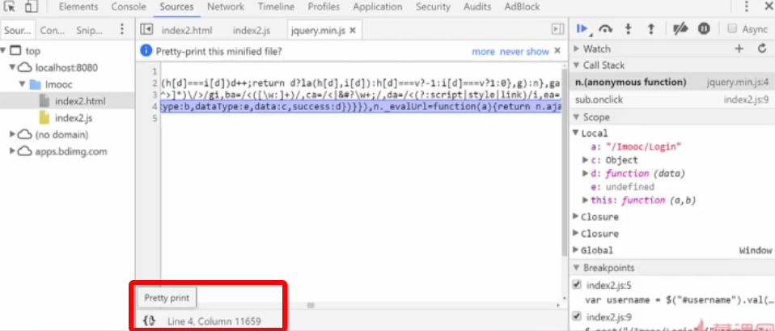

8.鼠标放在参数上面，就可以看见后端返回来的值： 
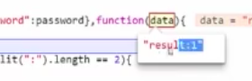

9.如果点击页面没有反应，可以看看network，如果出现下面这种情况，说明前端请求已经发出去了，但是后端没有给返回 
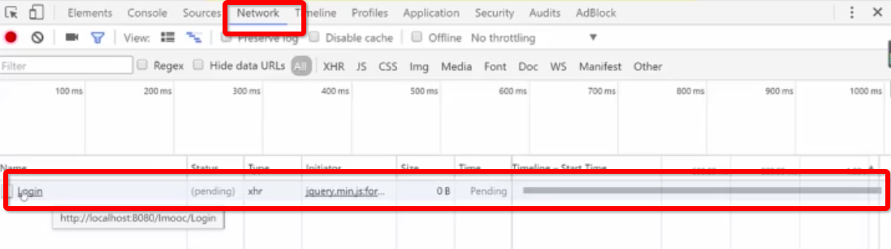

10.如果想要监控一个参数的值，比如这是个循环的值，想要看看这个程序执行的情况，可以如下操作：右击，add a watch 
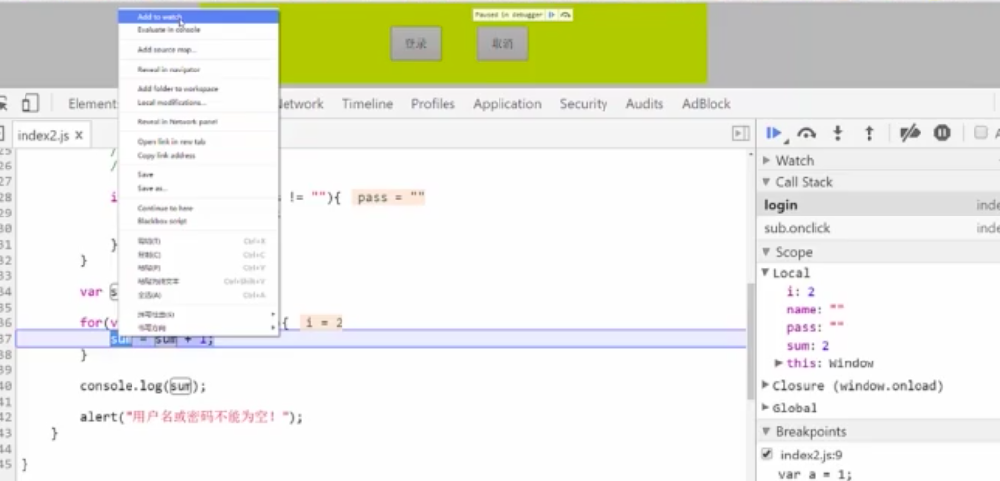
效果如下： 
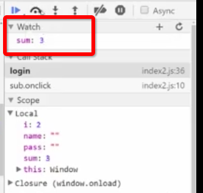

11.当找不到这个元素对应的js时，比如登陆按钮在element中找不到引入的js，但是又需要对这个登陆操作进行调试的时候，可以在 event listener  breakpoint下面打上事件监听的断点，当这个事件发生的时候，就会自动进入断点 
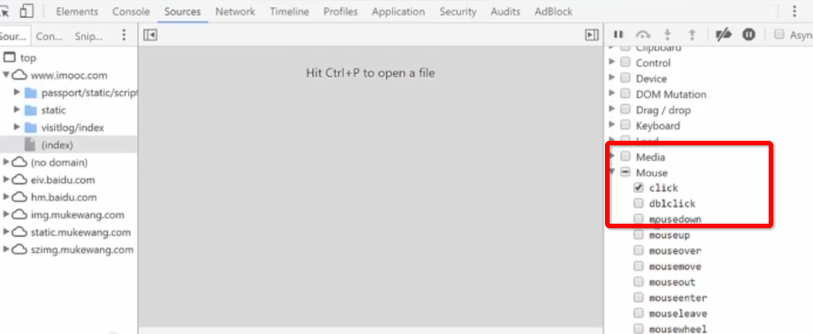
12.用chrome来调试手机页面： 
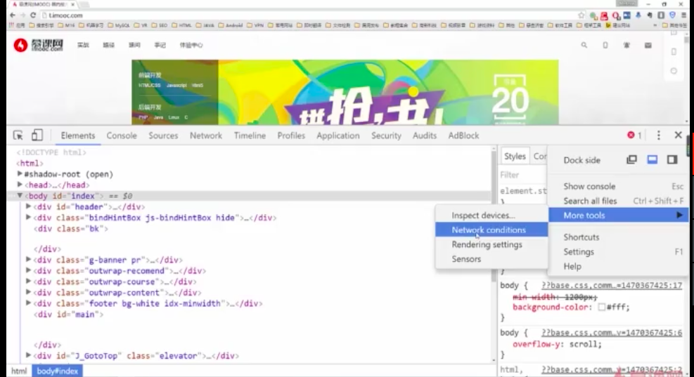

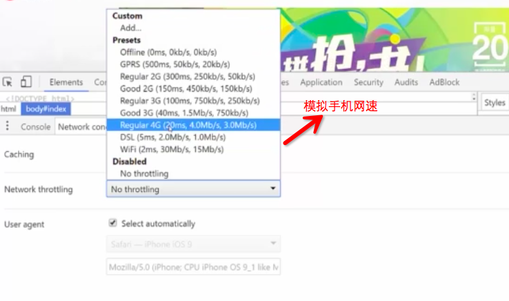

