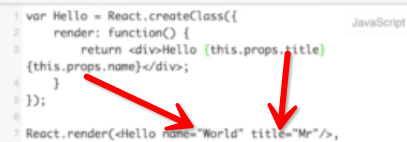
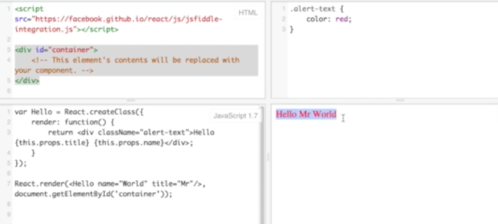
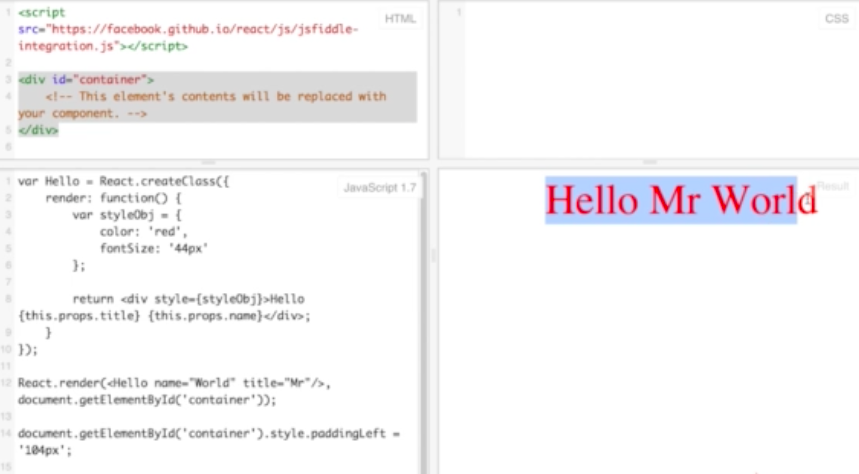
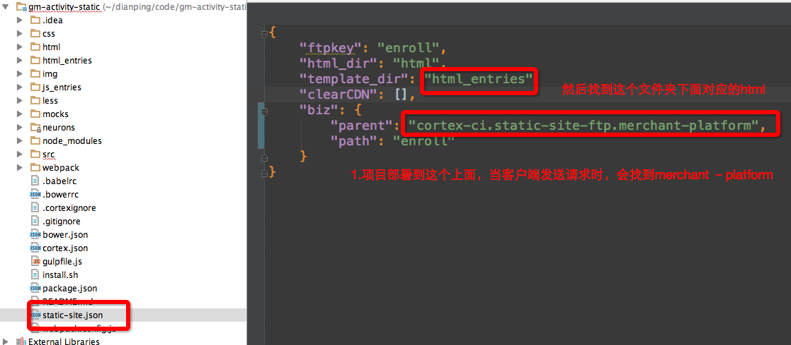
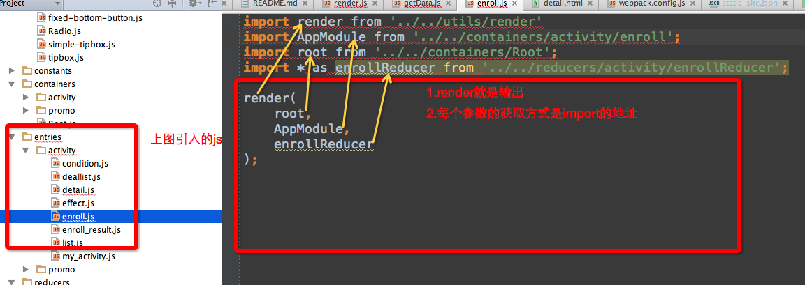

#### react好处特点
1.react不是一个完整的mvc，mvvc框架
2.react和web components不冲突
3.react比angular轻
4.组件化开发思路（高度可重用）
#### react的应用场景
1.复杂场景高性能
2.重用组件库
3.react的语法叫做jsx，解析过后是js代码
#### 如何在普通的js中引用jsx的语法代码

#### 基础语法
1.原声html标签和自定义的标签，在react中统称为react components，代表的不是一个dom节点，而是一个react components的实例

2.这些react components通过render这个方法来展示到页面上

从代码可以看到，这里是要把hello这个component渲染到id＝contaniner的div中
3.自定义的hello component的定义：（获取hello这个component的tiltel和name属性值）

引入css的写法

样式直接写在js代码中，最后的代码效果

实例应用逻辑：
### 项目结构：

> html_entries 存放html页面  
>  js_entries 存放是webpack编译src之后的中间文件的地方,不是编写代码的地方  
>  src 源代码目录，这里面的entries目录是存放每个页面入口的js，被webpack编译之后会放到 /js_entries  
> webpack :webpack的配置
第一步：客户端发出了如下的请求：https://h5.dianping.com/merchant-platform/enroll/activity/enroll.html（这里获取的是一个活动列表页面）

第二步：找到enroll.html

root代表这个页面总体的一个东西，同时会引入这个entries目录下面的enroll.js

首先是root节点的加载

然后是AppModule，AppModule里 面获取的是具体列表内容
最后是enrollReducer，enrollReducer是对AppModule的内容进行分发
待续。。。。

#### react相关知识
redux的核心概念就是store、action、reducer，从调用关系：
store.dispatch(action) --\> reducer(state, action) --\> final state
可以先看下面的极简例子有个感性的认识，下面会对三者的关系进行简单介绍
	// reducer方法, 传入的参数有两个
	// state: 当前的state
	// action: 当前触发的行为, {type: 'xx'}
	// 返回值: 新的state
	var reducer = function(state, action){
		switch (action.type) {
			case 'add_todo':
				return state.concat(action.text);
			default:
				return state;
		}
	};
	
	// 创建store, 传入两个参数
	// 参数1: reducer 用来修改state
	// 参数2(可选): [], 默认的state值,如果不传, 则为undefined
	var store = redux.createStore(reducer, []);
	
	// 通过 store.getState() 可以获取当前store的状态(state)
	// 默认的值是 createStore 传入的第二个参数
	console.log('state is: ' + store.getState());  // state is:
	
	// 通过 store.dispatch(action) 来达到修改 state 的目的
	// 注意: 在redux里,唯一能够修改state的方法,就是通过 store.dispatch(action)
	store.dispatch({type: 'add_todo', text: '读书'});
	// 打印出修改后的state
	console.log('state is: ' + store.getState());  // state is: 读书
	
	store.dispatch({type: 'add_todo', text: '写作'});
	console.log('state is: ' + store.getState());  // state is: 读书,写作
1.store：对flux有了解的同学应该有所了解，store在这里代表的是数据模型，内部维护了一个state变量，用例描述应用的状态。store有两个核心方法，分别是getState、dispatch。前者用来获取store的状态（state），后者用来修改store的状态。
	// 创建store, 传入两个参数
	// 参数1: reducer 用来修改state
	// 参数2(可选): [], 默认的state值,如果不传, 则为undefined
	var store = redux.createStore(reducer, []);
	
	// 通过 store.getState() 可以获取当前store的状态(state)
	// 默认的值是 createStore 传入的第二个参数
	console.log('state is: ' + store.getState());  // state is:
	
	// 通过 store.dispatch(action) 来达到修改 state 的目的
	// 注意: 在redux里,唯一能够修改state的方法,就是通过 store.dispatch(action)
	store.dispatch({type: 'add_todo', text: '读书'});
2.action：对行为（如用户行为）的抽象，在redux里是一个普通的js对象。redux对action的约定比较弱，除了一点，action必须有一个type字段来标识这个行为的类型。所以，下面的都是合法的action
	{type:'add_todo', text:'读书'}
	{type:'add_todo', text:'写作'}
	{type:'add_todo', text:'睡觉', time:'晚上'}
'reducer：一个普通的函数，用来修改store的状态。传入两个参数 state、action。其中，state为当前的状态（可通过store.getState()获得），而action为当前触发的行为（通过store.dispatch(action)调用触发）。reducer(state, action) 返回的值，就是store最新的state值。
	// reducer方法, 传入的参数有两个
	// state: 当前的state
	// action: 当前触发的行为, {type: 'xx'}
	// 返回值: 新的state
	var reducer = function(state, action){
	    switch (action.type) {
	        case 'add_todo':
	            return state.concat(action.text);
	        default:
	            return state;
	    }
	};

看到xxCreator总能让人联想到工厂模式，在redux里，actionAreator其实就是action的工厂方法，可以参考下面例子。
actionCreator(args) =\> action
	var addTodo = function(text){
	    return {
	        type: 'add_todo',
	        text: text
	    };
	};
	
	addTodo('睡觉');  // 返回：{type: 'add_todo', text: '睡觉'}

在redux里，actionAreator并非是必需的。不过建议用actionAreator代替普通action对象的直接传递。除了能够减少代码量，还可以大大提高代码的可维护性。想象下面的场景再来看回文章开头的例子，应用actionAreator后的代码示例。
	store.dispatch(addTodo('睡觉'));
	console.log('state is: ' + store.getState());  // state is: 读书,写作,睡觉