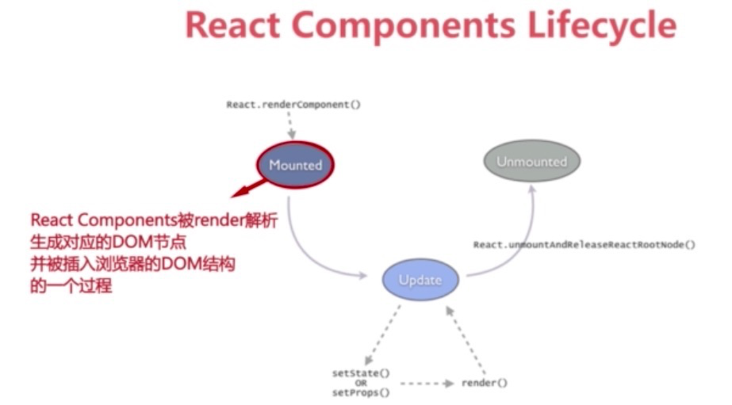
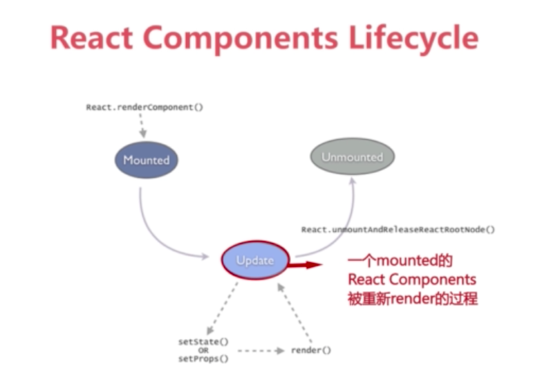
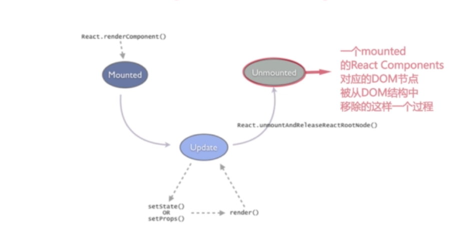
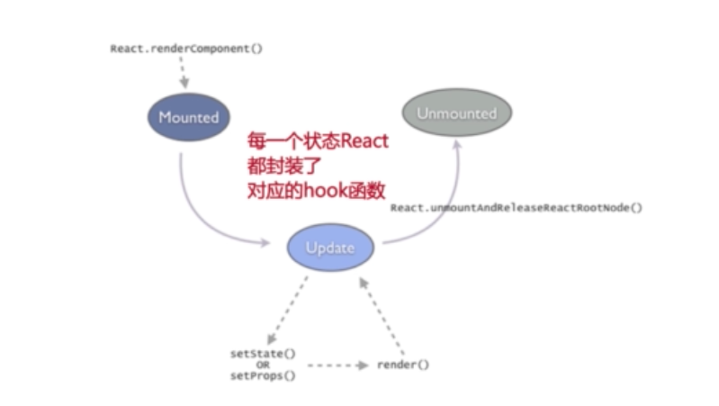
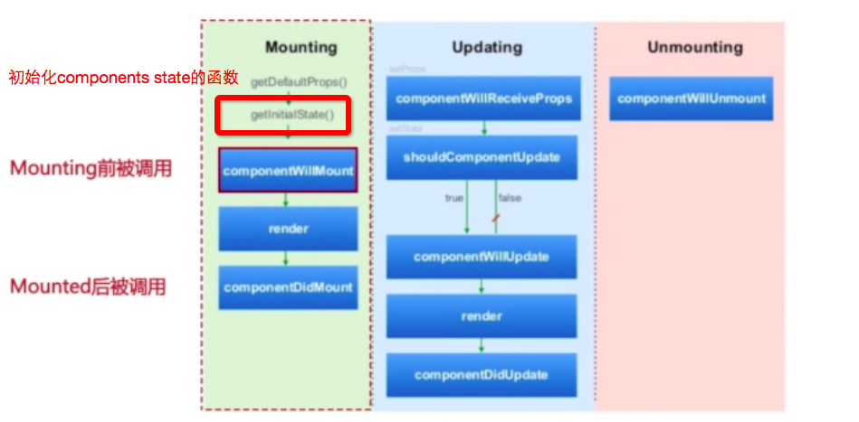
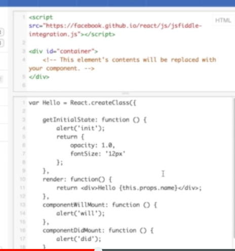
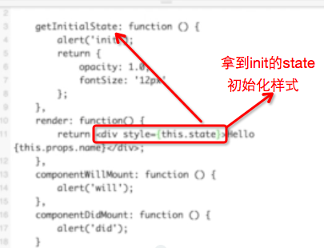

 react components 从创建到消失的状态和属性

这个重新渲染的过程不一定会改变这个component的dom节点，react会把这个component的当前statte和最近一次statue对比，只有当status 确实发生的改变，并且印象到了dom结构的时候，react才会去改变对应的dom结构

#### 什么是hook函数

下面这段代码的执行效果是：init－will－did

initstate的作用如下：

state是可变的
