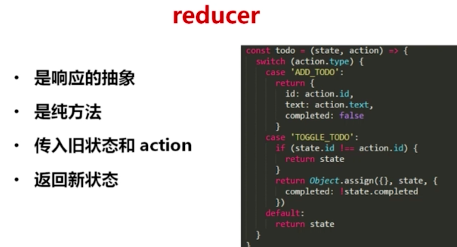

### 数据流

用户有各种各样的action，这些action由同一的dispatcher分发到store里面，一个action分发到若干个store里面，这些store里面存着用户的行为和数据，一个store只能向视图图传递信息，不允许v层反向作用，这样数据流就是单项的

### redux概述
redux是flux的一种实现 
redux的一个完整流程： 
当一个页面贝渲染出来的时候，就已经出现了ui，用户触发页面上action，action被送到reducer这个方法里面，reducer更新store，state包含在store里面，视图的东西是由state决定的，也就是render里面写的一些state方法，根据state来渲染ui 

container和业务紧密相连，不容易复用，但是component负责的是样式和布局，所以容易被复用 
