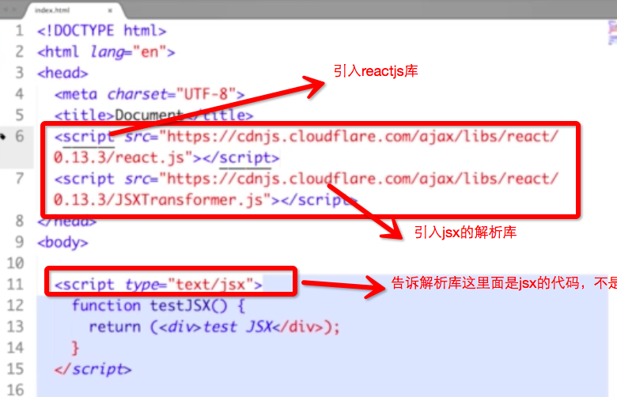
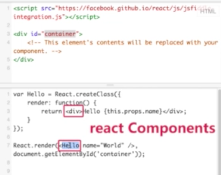

1.基本概念

2.创建和启动线程的两种方式

内存中一次只能有一个线程，线程之间是根据分时和抢占来完成的 
同一时间只有一个线程能够获得这个lockobj－这就保证了互斥，加锁实现互斥 

这些方法都是object对象的 
当一个线程不满足条件的时候，调用wait（）方法，这个当前线程会被放入一个等待的集合，就是wait set 
wait（）和notifyall（）方法不是在同一个线程上实现的，notifyall是当满足又条件了用来唤醒所有在等待集合中的线程的。 
这是同步，所以肯定是在多个线程之间进行操作，不可能在一个线程上进行的 
