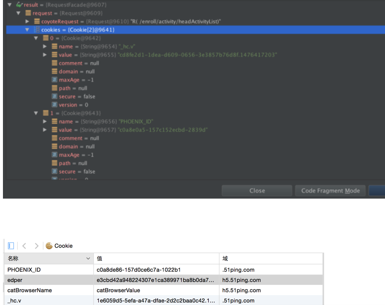
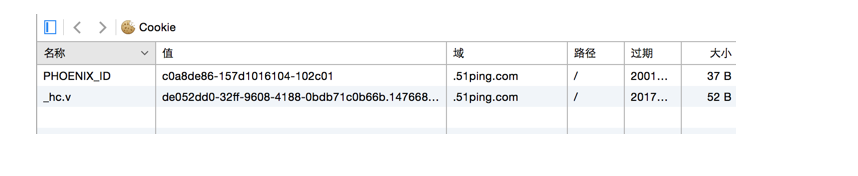
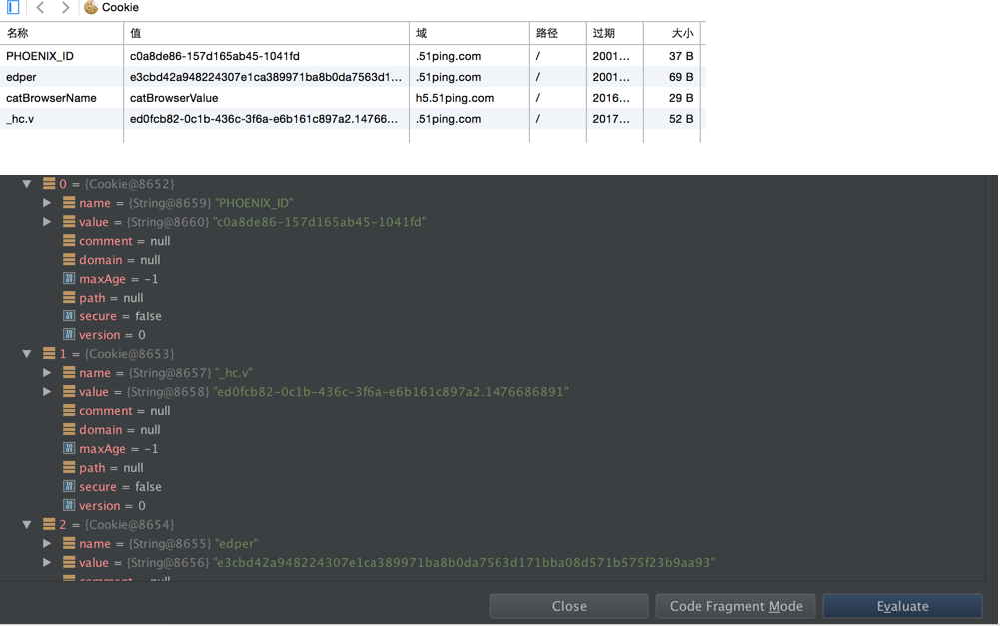

# 跨域知识整理
### 跨域是什么
首先了解一下域名的概念。一个完整的域名由二个或二个以上部分组成，各部分之间用英文的句号"."来分隔，最后一个"."的右边部分称为顶级域名，一级域名中只含有一个“.”，且“.”左边要有内容字段。一级域名增加一个字段就是二级域名，二级域名的左边部分称为三级域名，以此类推，每一级的域名控制它下一级域名的分配。例如：
（
    .com .top 顶级域名
    baidu .com     baidu.top 一级域名
    www.baidu .com 二级域名
    bbs.baidu .com 二级域名
    tieba.baidu .com 二级域名
）
   跨域是发生在浏览器的事情，如果两个页面拥有相同的协议（protocol），端口（如果指定），和域名，那么这两个页面就属于同一个源（origin)，注: 端口见浏览器是否跨域看浏览器是否支持, 相同的协议必须是相同的子域,一个大域名下也不行。例如: 我的浏览器想访问第三方的服务器的资源, 用iframe的方式, 能展示页面,却无法操作他上面的dom元素，或者用ajax直接访问, 浏览器直接抛错
 但是第三方的静态资源如果不做限制,是可以直接访问使用的, 例如js,css image
### 为什么要同源限制
 个人信息泄露与安全 我用A网站上用iframe方式去加载第三方的页面,例如银行,或者邮箱, A网站使用脚本读取你登陆后的cookie消息， 从而获取你的私人信息，记录在A网站上, 甚至操作DOM元素,例如点击“转账”按钮。
### 解决方案
#### 方案－跨域资源共享 CORS
第一步：预检请求时，服务端在请求头中添加字段
（1）Access-Control-Allow-Origin
 
该字段是必须的。它的值要么是请求时Origin字段的值，要么是一个*，表示接受任意域名的请求。
 
（2）Access-Control-Allow-Credentials
该字段可选。它的值是一个布尔值，表示是否允许发送Cookie。
	
	@Override
	public void doFilter(ServletRequest request, ServletResponse response, FilterChain chain) throws IOException, ServletException {
	    HttpServletResponse resp = (HttpServletResponse)response;
	    resp.setHeader("Access-Control-Allow-Origin", LionConfigUtils.getProperty(LION_CROSS_ORIGIN));
	    resp.setHeader("Access-Control-Allow-Credentials", "true");
	//  resp.setHeader("Access-Control-Allow-Headers", "edper");   //在实际的请求中,可以使用的自定义HTTP请求头
	 
	    HttpServletRequest req = (HttpServletRequest) request;
	    if (req.getMethod().equals("OPTIONS")) {
	        resp.setStatus(200);
	        resp.flushBuffer();
	    } else {
	        chain.doFilter(request,response);
	    }
	}
	

  

第二步：客户端需要在XMLHttpRequest 请求中设置withCredentials属性为true
  

var xhr = new XMLHttpRequest();
xhr.withCredentials = true;
  

第三步：设置document.cookie
在XMLHttpRequest 请求发出之前设置 document.cookie="edper=xxx"
  

2 使用jsonp 跨域
 
  JSONP是JSON with Padding的略称。它是一个非官方的协议，它允许在服务器端集成Script tags返回至客户端，通过javascript callback的形式实现跨域访问。JSONP也叫填充式JSON，是应用JSON的一种新方法，只不过是被包含在函数调用中的JSON，例如：callback("message":"success")。JSONP由两部分组成：回调函数和数据。回调函数是当响应到来时应该在页面中调用的函数，而数据就是传入回调函数中的JSON数据。
 
---它的原理简述为三点：
 
1、浏览器的同源策略把跨域请求都禁止了；
 
2、HTML的\
	  
	b网页：
	
 
       js文件载入成功后会执行我们在url参数中指定的函数，并且会把我们需要的json数据作为参数传入。所以jsonp是需要服务器端的页面进行相应的配合的。其中，foo为回调函数，获取不同源的数据。说明下为什么要将addScriptTag方法放入到window.onload的方法里，原因是addScriptTag方法中有句document.body.appendChild(script);，这个script标签是被添加到body里的，由于我们写的javascript代码是在head标签中，document.body还没有初始化完毕呢，所以我们要通过window.onload方法先初始化页面，这样才不会出错。
  该方式其实是利用\<script\>可以跨域的特性
   A 发出一个这样格式的js 文件请求 xxx.js?callback=functionName
      然后定义一个全局的functionName
  C 对这样的js 专门写对应的接口渲染一份JS代码,
    先根据请求做对应处理, 把返回结果拿出来
    接着渲染一个分js代码 $functionName(xx,yyy,zz); 这样的格式
   其中xx,yy,zz 最好是json格式
  缺点: 仅支持get请求
3 在A使用ajax 向C请求,提交,上传资源
   这个需要在C服务器端配置 response.setHeader("Access-Control-Allow-Origin",  A站域名); 
   缺点: 老版IE貌似不支持
4 A使用flash 跨域请求C资源
  利用flash 请求一些跨域资源,然后回调A的JS
  需要在C根目录 crossdomain.xml (这个属于flash通讯协议的范畴)配置A的域名 
 缺点: 需要引用flash, 常见于一些flash云组件,例如美图秀秀, 还有flash属于慢慢淘汰的东西
  

以下是需要A与C要保持长期联络的方式 (不考虑短轮询jsonp方式)
  

5 使用iframe场景2： 使用url hash 变化来通讯
 hash  是值 url 中 带#的一段, 例如 http://localhost/aaa/#name=xiaoming, 然后可以用interval 与 监控这个url是否改变
  A 使用iframe调用C页面, 然后监听iframe url中的变化, 也可以通过改变iframe的url 的hash值来通知C
  C 则也同时监听监听iframe url中的变化，也可以通过改变iframe的url 的hash值来通知A
缺点:实现起来有点复杂
遇到的问题
 问题1  服务端拿不到cookie,  客户端没有发送cookie
 
 解决方法
 
 依赖的模块设置了这个条件 credentials: "include" ＝\> xhr.withCredentials = true  客户端发送cookie
 
 问题2 客户端发送了cookie，但服务端只能拿到两个字段，edper和catBrowserName拿不到
 

 
 
 

 
 
 
如果第三步不做 edper和catBrowserName都没有
 

 
  

 
说明这是cookie所在域的问题。
 
解决方法
 
跨域请求时，如果要发送cookie,有两点需要注意：
 
1   Access-Control-Allow-Origin不能设为星号，必须指定明确的、与请求网页一致的域名。
 
2       Cookie依然遵循同源政策，只有用服务器域名设置的Cookie才会上传，其他域名的Cookie并不会上传，并且网页代码中的document.cookie也无法读取服务器域名下的Cookie。
 
  

 
pc端cookie的domain 配置在lion 上 avatar-biz.CookieDomain  值为.51ping.com
 
在客户端设置cookie时，需要指定服务器端可访问cookie的路径,  设置cookie.domain 与服务器域名一致（.51ping.com）和 cookie.path 为根路径
 
 
 

 

参考资料：[https://developer.mozilla.org/zh-CN/docs/Web/HTTP/Access_control_CORS#Access-Control-Allow-Headers](#)
